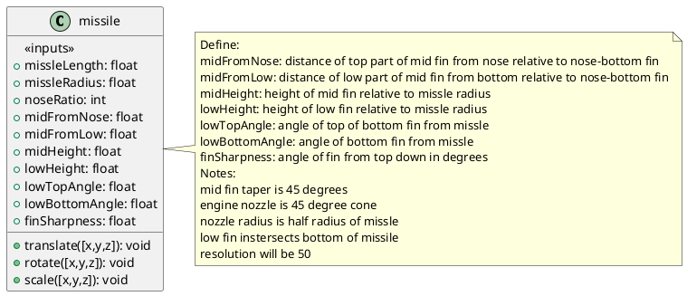

### Missile Class Diagram

```puml
@startuml
class missile {
    <<inputs>>
    +missleLength: float
    +missleRadius: float
    +noseRatio: int
    +midFromNose: float
    +midFromLow: float
    +midHeight: float
    +lowHeight: float
    +lowTopAngle: float
    +lowBottomAngle: float
    +finSharpness: float
    +translate([x,y,z]): void
    +rotate([x,y,z]): void
    +scale([x,y,z]): void
}
note right of missile
Define:
midFromNose: distance of top part of mid fin from nose relative to nose-bottom fin
midFromLow: distance of low part of mid fin from bottom relative to nose-bottom fin
midHeight: height of mid fin relative to missle radius
lowHeight: height of low fin relative to missle radius
lowTopAngle: angle of top of bottom fin from missle
lowBottomAngle: angle of bottom fin from missle
finSharpness: angle of fin from top down in degrees
Notes:
mid fin taper is 45 degrees
engine nozzle is 45 degree cone
nozzle radius is half radius of missle
low fin instersects bottom of missile
resolution will be 50
end note
@enduml
```