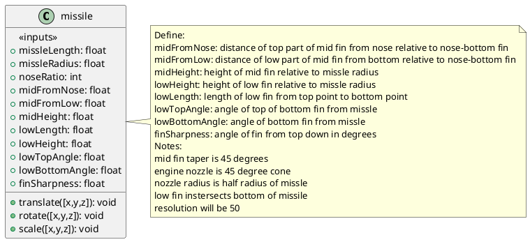
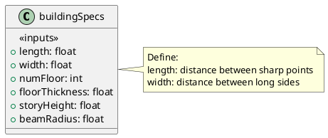
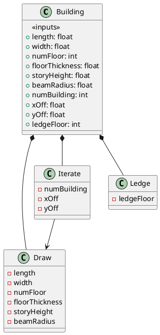

### Missile Class Diagram

```puml
@startuml
class missile {
    <<inputs>>
    +missleLength: float
    +missleRadius: float
    +noseRatio: int
    +midFromNose: float
    +midFromLow: float
    +midHeight: float
    +lowLength: float
    +lowHeight: float
    +lowTopAngle: float
    +lowBottomAngle: float
    +finSharpness: float
    +translate([x,y,z]): void
    +rotate([x,y,z]): void
    +scale([x,y,z]): void
}
note right of missile
Define:
midFromNose: distance of top part of mid fin from nose relative to nose-bottom fin
midFromLow: distance of low part of mid fin from bottom relative to nose-bottom fin
midHeight: height of mid fin relative to missle radius
lowHeight: height of low fin relative to missle radius
lowLength: length of low fin from top point to bottom point
lowTopAngle: angle of top of bottom fin from missle
lowBottomAngle: angle of bottom fin from missle
finSharpness: angle of fin from top down in degrees
Notes:
mid fin taper is 45 degrees
engine nozzle is 45 degree cone
nozzle radius is half radius of missle
low fin instersects bottom of missile
resolution will be 50
end note
@enduml
```
### Building Class Diagram 1

```puml
@startuml
class buildingSpecs {
    <<inputs>>
    +length: float
    +width: float
    +numFloor: int
    +floorThickness: float
    +storyHeight: float
    +beamRadius: float
}
note right of buildingSpecs
Define:
length: distance between sharp points
width: distance between long sides
end note
@enduml
```
### Building Class Diagram 2

```puml
@startuml
class Building {
    <<inputs>>
    +length: float
    +width: float
    +numFloor: int
    +floorThickness: float
    +storyHeight: float
    +beamRadius: float
    +numBuilding: int
    +xOff: float
    +yOff: float
    +ledgeFloor: int
}
class Draw {
-length
-width
-numFloor
-floorThickness
-storyHeight
-beamRadius
}
class Iterate {
    -numBuilding
    -xOff
    -yOff
}
class Ledge {
    -ledgeFloor
}
Building *-- Draw
Building *-- Iterate
Iterate --> Draw
Building *-- Ledge
@enduml
```