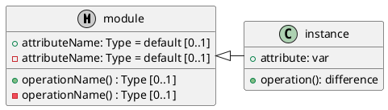
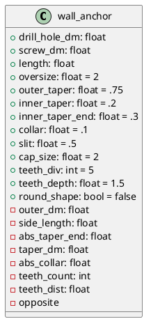

# Documentation
### General Class Diagram

```puml
@startuml
metaclass module {
    +attributeName: Type = default [0..1]
    -attributeName: Type = default [0..1]
    +operationName() : Type [0..1]
    -operationName() : Type [0..1]
}
class instance {
    +attribute: var
    +operation(): difference
}
module <|-right- instance
@enduml
```
### Window Stopper Class Diagram

```puml
@startuml
class wall_anchor {
    +drill_hole_dm: float
    +screw_dm: float
    +length: float
    +oversize: float = 2
    +outer_taper: float = .75
    +inner_taper: float = .2
    +inner_taper_end: float = .3
    +collar: float = .1
    +slit: float = .5
    +cap_size: float = 2
    +teeth_div: int = 5
    +teeth_depth: float = 1.5
    +round_shape: bool = false
    -outer_dm: float
    -side_length: float
    -abs_taper_end: float
    -taper_dm: float
    -abs_collar: float
    -teeth_count: int
    -teeth_dist: float
    -opposite
}
@enduml
```