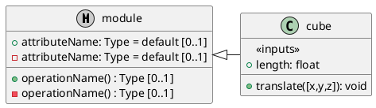
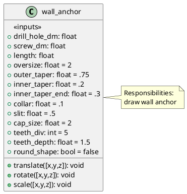
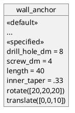
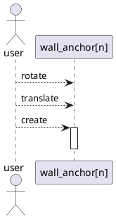

# Documentation
### General Class Diagram

```puml
@startuml
metaclass module {
    +attributeName: Type = default [0..1]
    -attributeName: Type = default [0..1]
    +operationName() : Type [0..1]
    -operationName() : Type [0..1]
}
class cube {
    <<inputs>>
    +length: float
    +translate([x,y,z]): void
}
module <|-right- cube
@enduml
```
### Wall Anchor Class Diagram

```puml
@startuml
class wall_anchor {
    <<inputs>>
    +drill_hole_dm: float
    +screw_dm: float
    +length: float
    +oversize: float = 2
    +outer_taper: float = .75
    +inner_taper: float = .2
    +inner_taper_end: float = .3
    +collar: float = .1
    +slit: float = .5
    +cap_size: float = 2
    +teeth_div: int = 5
    +teeth_depth: float = 1.5
    +round_shape: bool = false
    +translate([x,y,z]): void
    +rotate([x,y,z]): void
    +scale([x,y,z]): void
}
note right of wall_anchor
Responsibilities:
draw wall anchor
end note
@enduml
```
### Wall Anchor Object Diagram

```puml
@startuml
object wall_anchor {
<<default>>
...
<<specified>>
drill_hole_dm = 8
screw_dm = 4
length = 40
inner_taper = .33
rotate([20,20,20])
translate([0,0,10])
}
@enduml
```
### Sequence Diagram

```puml
@startuml
actor user
participant "wall_anchor[n]" as wall_anchor
user --> wall_anchor : rotate
user --> wall_anchor : translate
user --> wall_anchor : create
activate wall_anchor
deactivate wall_anchor
@enduml
```